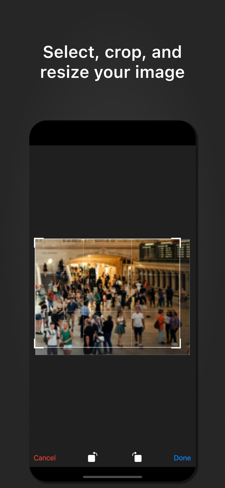
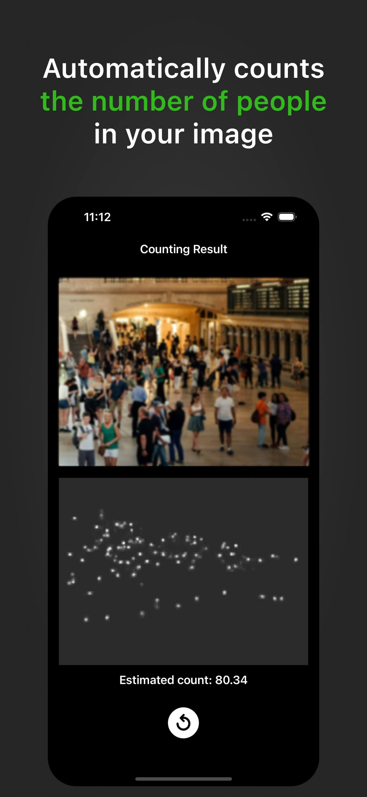
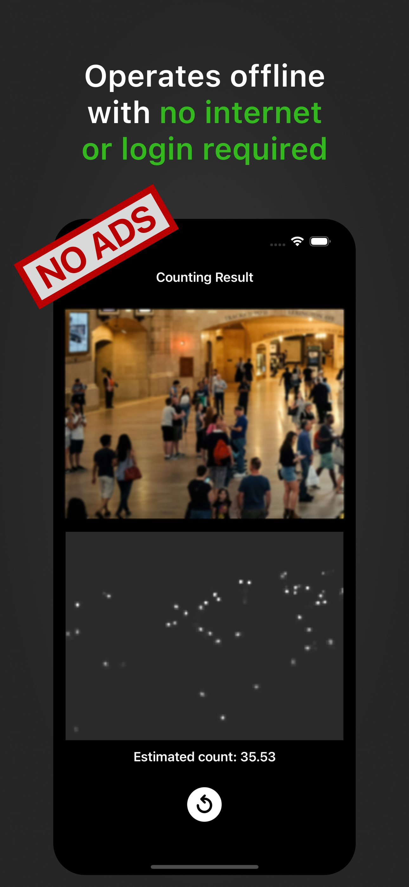
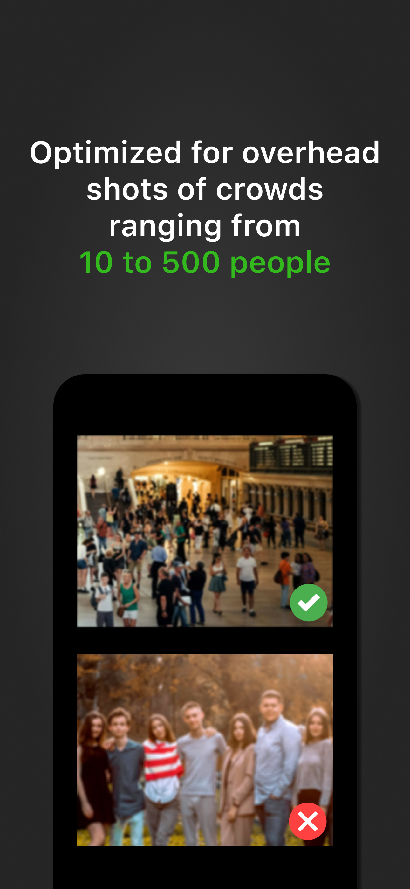

# image-crowd-counter

An automated analysis algorithm counts the number of people in an image.

No internet connection or login is required, and it's free without ads.

    
    
    
    

It's hard to manually count how many people are in a scene.

This app automates that counting process.

It operates on-device, so no internet connection or login is needed.

- Optimized for overhead shots of crowds ranging from 10 to 500 people
- The app may not function properly on older models.
